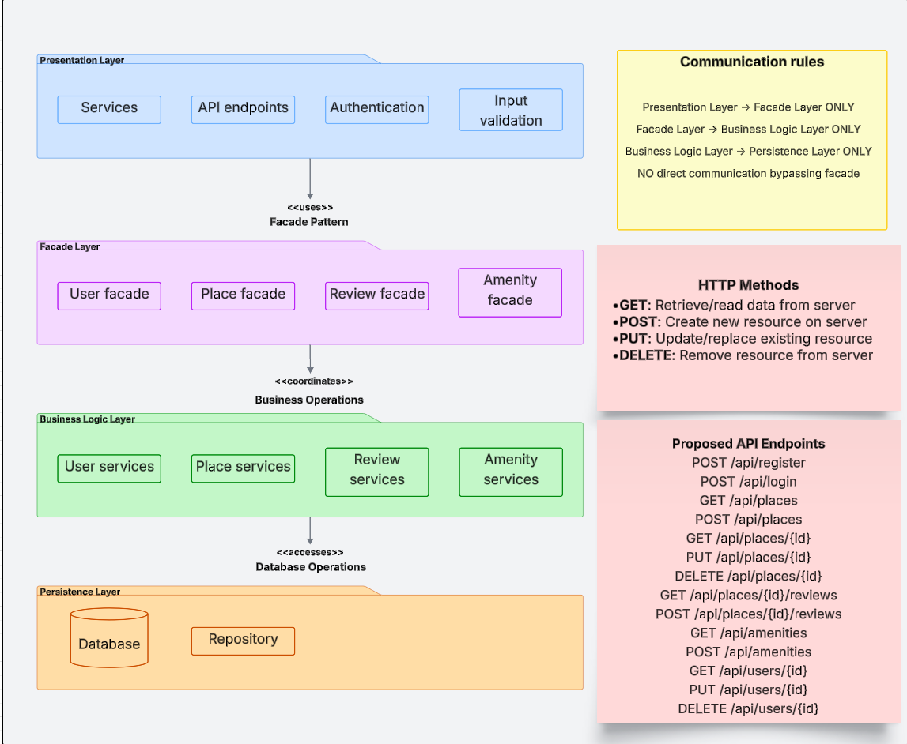
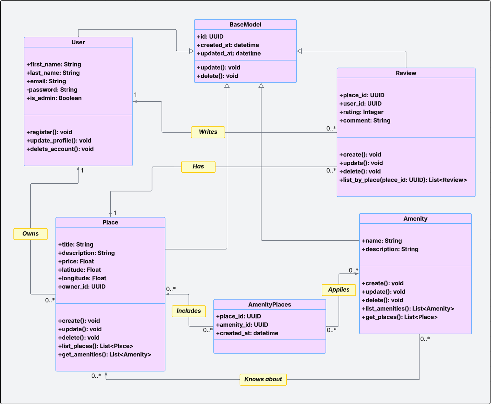
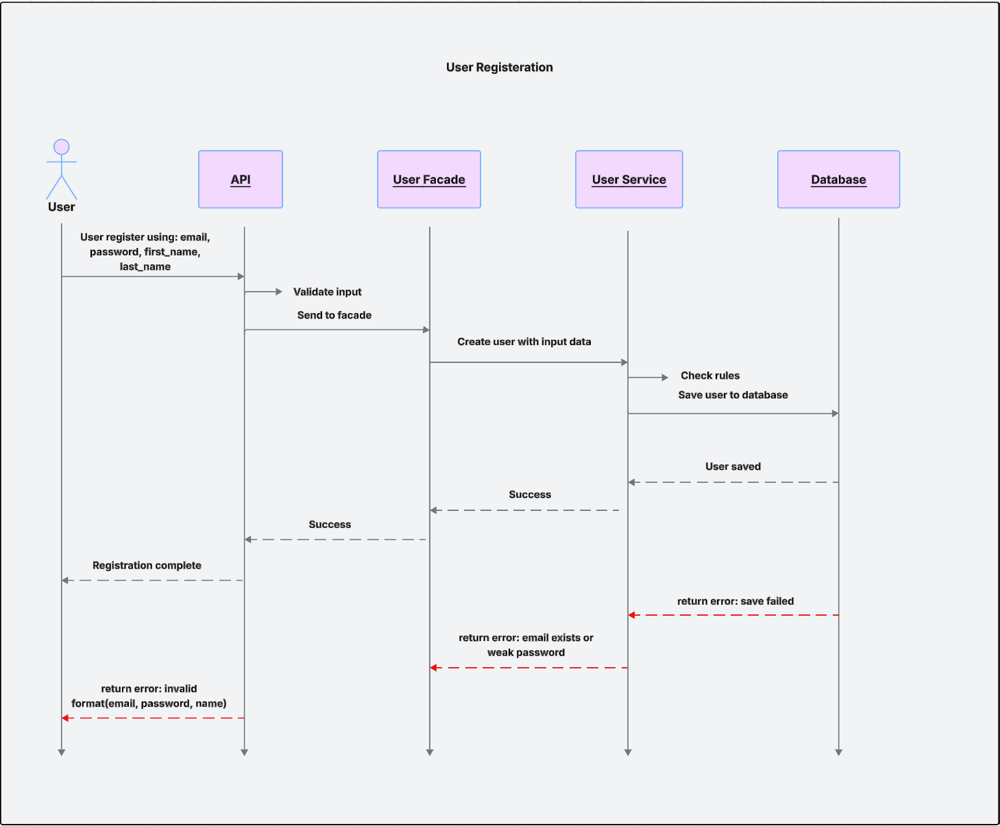
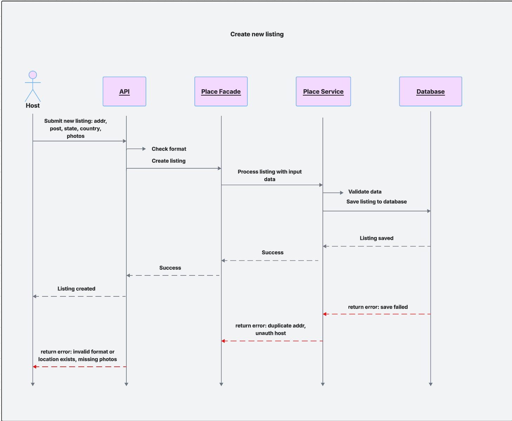
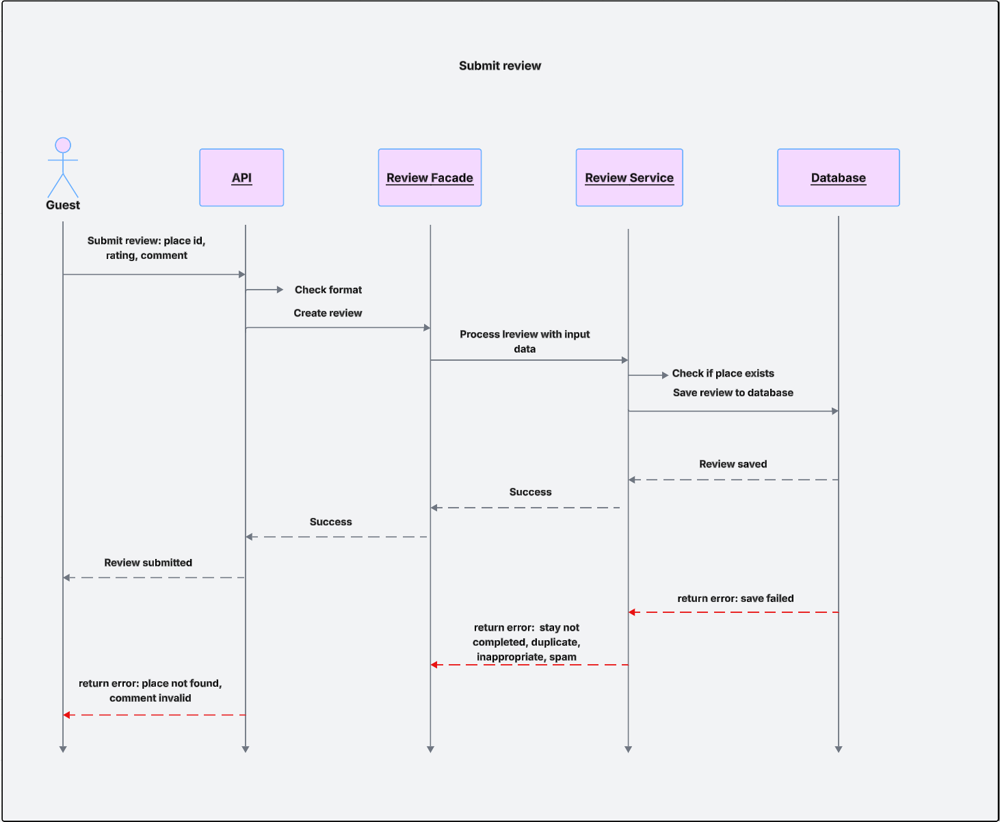
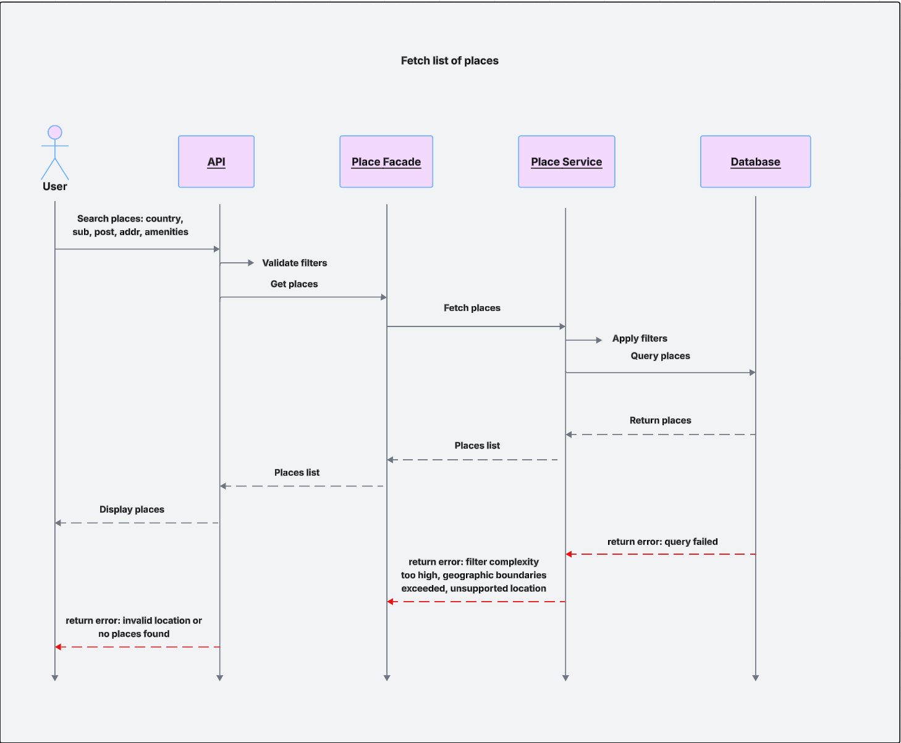

# HBnB Evolution

**Technical Documentation**

## 1. Introduction

### Purpose of the Document

This document serves as the technical blueprint for the development of the HBnB Evolution application; a simplified, AirBnB-inspired platform. It compiles the high-level architectural overview, detailed class design, and interaction flows between system components to provide a comprehensive reference for the development of the application.

### Project Overview

HBnB Evolution is an application that enables users to register accounts, manage property listings, submit and view reviews, associate properties with various amenities and associate amenities with various properties. It adopts a layered architecture to separate concerns between user-facing services, core business logic, and persistent storage. The project follows object-oriented design principles and UML standards to ensure clarity, scalability, and maintainability.

### Scope & Structure of the Document

This document includes:

- A high-level package diagram illustrating the application's three-tier architecture (Presentation, Business Logic, and Persistence layers) and the use of the Facade pattern for inter-layer communication.
- A detailed UML class diagram representing the core entities in the business logic layer (User, Place, Review, Amenity, and AmenityPlaces), including their attributes, methods, and inter-relationships.
- Four UML sequence diagrams demonstrating the internal flow of key API operations: user registration, place creation, review submission, and fetching a list of places.
- Explanatory notes accompanying each diagram to clarify design rationale and interactions across system components.

## 2. High-Level Architecture

### 2.1 Overview of Layered Architecture

The HBnB Evolution Application uses a four-tier layered architecture with clear separation of responsibilities:

- **Presentation Layer**: Handles HTTP requests through REST API endpoints, manages authentication, and validates input data before processing.
- **Facade Layer**: Provides simplified interfaces (User, Place, Review, Amenity facades) that hide system complexity and serve as single entry points for client interactions.
- **Business Logic Layer**: Implements core business rules and workflows through service components that process domain operations and enforce application policies.
- **Persistence Layer**: Manages all database operations including CRUD functions, query execution, and data mapping between application objects and database entities.

Each layer communicates only with adjacent layers, ensuring maintainability and allowing independent modification without affecting the entire system.

### 2.2 Package Diagram

### 2.3 Communication Flow

#### Layer Communication Rules:
- Presentation Layer communicates only with Facade Layer
- Facade Layer communicates only with Business Logic Layer
- Business Logic Layer communicates only with Persistence Layer
- No direct communication bypassing the facade layer

#### Request Flow:
1. Client sends HTTP request to Presentation Layer API endpoint
2. Presentation Layer routes request to appropriate Facade component
3. Facade delegates operation to corresponding Business Logic service
4. Business Logic service accesses data through Persistence Layer repository
5. Response flows back through each layer to the client

## 3. Business Logic Layer (Class Design)

### 3.1 Overview of Core Entities

The Business Logic Layer of the HBnB application is centered around four core entities that represent the application's main functional components:

#### User
The User class models individuals who interact with the platform. Users can register, update their profiles, delete their profiles and be flagged as administrators. They are responsible for creating places and submitting reviews.

#### Place
The Place class represents properties listed by users on the platform. Each place includes descriptive fields such as title, description, price, and location (latitude and longitude). A place is owned by a user and may be associated with multiple amenities (represented by an association class called AmenityPlaces) and reviews.

#### Review
The Review class captures feedback that users leave on places they have visited. Each review includes a rating and comment, and is linked to both a specific user (the reviewer) and a specific place. Reviews are not deleted in the event the User deletes their profile.

#### Amenity
The Amenity class defines features or facilities (e.g., Wi-Fi, air conditioning) that can be associated with places. Amenities are linked to places via a many-to-many relationship, represented by an association class (AmenityPlaces).

### 3.2 Class Descriptions

#### BaseModel

The BaseModel class is the foundational superclass for all core entities in the HBnB Evolution application. It captures common attributes and behaviours shared by all models in the Business Logic layer.

**Attributes:**
- `id`: UUID
- `created_at`: datetime
- `updated_at`: datetime

**Methods:**
- `update()`: updates the updated_at timestamp and persists changes
- `delete()`: marks the object for deletion or removes it from the persistence layer

**Relationships:**
- This class does not have direct relationships but is inherited by all core entities (User, Place, Review and Amenity)

#### User

The User class represents the individuals who interact with the system. Users can register, update their profile, delete their profile and may be either regular users or administrators.

**Attributes:**
- `id`: UUID
- `first_name`: string
- `last_name`: string
- `email`: string
- `password`: string
- `is_admin`: bool
- `created_at`: datetime
- `updated_at`: datetime

**Methods:**
- `register()`
- `update_profile()`
- `delete_account()`

**Relationships:**
- 1 → * with Place (owns)
- 1 → * with Review (writes)

#### Place

The Place class represents property listings created by users. Each place includes descriptive and geographic information and can be associated with multiple amenities.

**Attributes:**
- `id`: UUID
- `title`: string
- `description`: string
- `price`: float
- `latitude`: float
- `longitude`: float
- `created_at`: datetime
- `updated_at`: datetime

**Methods:**
- `create()`
- `update()`
- `delete()`
- `list_places()`

**Relationships:**
- * → 1 with User (owned by)
- 1 → * with Review (has)
- * → * with Places (has)
- 1 → * with AmenitiesPlaces (linked to amenities)

#### Review

The Review class captures feedback left by users for a specific place.

**Attributes:**
- `id`: UUID
- `rating`: int
- `comment`: string
- `created_at`: datetime
- `updated_at`: datetime

**Methods:**
- `create()`
- `update()`
- `delete()`
- `list_by_place(place_id: UUID)`

**Relationships:**
- * → 1 with User (written by)
- * → 1 with Place (about)

#### Amenity

The Amenity class represents a feature or service available at one or more places (e.g., Wi-Fi, pool, etc.).

**Attributes:**
- `id`: UUID
- `name`: string
- `description`: string
- `created_at`: datetime
- `updated_at`: datetime

**Methods:**
- `create()`
- `update()`
- `delete()`
- `list_amenities()`

**Relationships:**
- 1 → * with AmenitiesPlaces (offered in)
- * → * with Places (applies to)

#### AmenityPlaces

The AmenityPlaces class is a linking model that resolves the many-to-many relationship between Place and Amenity. This intermediate object ensures relational clarity and search efficiency.

**Attributes:**
- `id`: UUID
- `place_id`: UUID
- `amenity_id`: UUID
- `created_at`: datetime
- `updated_at`: datetime

**Relationships:**
- * → 1 with Place
- * → 1 with Amenity

### 3.3 Class Diagram

### 3.4 Relationship Summary

| Relationship | Type | Multiplicity | Notes |
|--------------|------|--------------|-------|
| User → Place | Association | 1 → 0..* | A user can own multiple places |
| User → Review | Association | 1 → 0..* | A user can write multiple reviews and reviews aren't deleted if a user is deleted |
| Place → Review | Association | 1 → 0..* | A place can have multiple reviews |
| Place ↔ Amenity | Association Class | 0..* ↔ 0..* | Modeled via AmenityPlaces |
| Place → AmenityPlaces | Association | 1 → 0..* | Links place to multiple amenities |
| Amenity → AmenityPlaces | Association | 1 → 0..* | Links amenity to multiple places |
| AmenityPlaces → Place | Association | * → 1 | Join back to Place |
| AmenityPlaces → Amenity | Association | * → 1 | Join back to Amenity |
| BaseModel → All classes | Inheritance | — | Each of the core entities inherit from a shared base |

## 4. API Interaction Flow (Sequence Diagrams)

### 4.1 Sequence Diagram: User Registration

This sequence diagram illustrates the process flow for a user registering in the system, covering both successful registration and possible error scenarios.

#### Actors and Components:
- **User**: Fills in the registration form
- **API**: Receives data and checks for input format
- **User facade**: Passes data to the service layer
- **User service**: Handles the registration logic and validation
- **Database**: Stores user information

#### Success Path:
1. User submits data: email, password, first name, last name
2. API validate the format (e.g., correct email format, non-empty password)
3. Data is sent to the User Facade
4. User Facade forwards the data to User Service
5. User Service:
   - Checks if email is already registered
   - Verifies if the password meets requirements
   - If everything is valid, save the user to the Database
6. Database confirms the user is saved successfully
7. Return "Registration complete"

#### Error Flows:
- **Input Error**: If email format is wrong or password too short, the API returns an error message
- **Business Rule Error**: If the email already exists or password too weak, User Service returns an error
- **Database Error**: If saving the user fails (e.g., database issue, server down), an error message is returned to the User

### 4.2 Sequence Diagram: Place Creation

This sequence diagram illustrates the process flow for a host creating a new property listing in the system, covering both successful listing creation and possible error scenarios.

#### Actors and Components:
- **Host**: Submits new property listing information
- **API**: Receives listing data and checks for basic format
- **Place Facade**: Handles business logic, validates the listing
- **Database**: Stores the listing information

#### Success Path:
1. Host submits a new listing with: address, postcode, state, country
2. API checks if the input format is correct (e.g., address not empty, correct post code length, etc.)
3. Data then pass to Place Facade
4. Place Facade forwards the data to Place Service
5. Place service:
   - Validates the listing (e.g., checks for duplicate addresses, authorized host, etc.)
   - Saves the listing to the Database
6. Database confirms the listing is saved
7. Returns success to Host: "Listing created"

#### Error Flows:
- **Input Error**: If format is invalid, location missing, or required photos are not attached, the API returns an error
- **Business Rule Error**: If the address already exists or the host is not authorized, Place Service returns an error
- **Database Error**: If saving the listing fails, an error message is returned to the Host

### 4.3 Sequence Diagram: Review Submission

This sequence diagram illustrates the process flow for a guest submitting a review in the system, covering both successful submission and possible error scenarios.

#### Actors and Components:
- **Guest**: Submits a review for a property
- **API**: Receives review data and checks basic format
- **Review Facade**: Passes the review data to the service layer
- **Review Service**: Handles review logic and validations
- **Database**: Stores the review information

#### Success Path:
1. Guest submits review data: place ID, rating, comment
2. API validates the input format (e.g., rating is a number, comment is not empty)
3. Data is passed to the Review Facade
4. Review Facade forwards the data to Review Service
5. Review Service:
   - Check if the place exists
   - Ensures the review meets all requirements (e.g., stay completed, no duplicates)
   - Saves the review to the Database
6. Database confirms the review is saved successfully
7. System returns success to the Guest: "Review submitted"

#### Error Flows:
- **Input Error**: If the comment is invalid or the place ID format is incorrect, the API returns an error
- **Business Rule Error**: If the place does not exist, the stay is not completed, the review is duplicated, or the content is inappropriate/spam, Review Service returns an error
- **Database Error**: If saving the review fails (e.g., database issue), an error message is returned to the Guest

### 4.4 Sequence Diagram: Fetching Places

This sequence diagram illustrates the process flow for a user searching for available places in the system, covering both successful searches and possible error scenarios.

#### Actors and Components:
- **User**: Searches for available places
- **API**: Receives search filters and validates them
- **Place Facade**: Passes search requests to the service layer
- **Place Service**: Handles business logic, applies filters, and queries places
- **Database**: Stores and retrieves place listings

#### Success Path:
1. User submits search filters: country, suburb, postcode, address, amenities
2. API validates the filters (e.g., correct format, reasonable search criteria)
3. Filters are passed to the Place Facade
4. Place Facade forwards the request to Place Service
5. Place Service:
   - Applies filters and query conditions
   - Sends a query to the Database to retrieve matching places
6. Database returns the list of places
7. Place Service returns the list back to the Place Facade
8. API receives the place list and displays it to the User

#### Error Flows:
- **Input Error**: If filters are invalid or no places are found, the API returns an error message
- **Business Rule Error**: If the filter complexity is too high, geographic boundaries are exceeded, or the location is unsupported, Place Service returns an error
- **Database Error**: If the query to the Database fails (e.g., system issue), an error message is returned to the User

## 5. Summary

This technical documentation provides a comprehensive blueprint for the HBnB Evolution application. The layered architecture ensures separation of concerns and maintainability, while the detailed class design and sequence diagrams provide clear guidance for implementation. The use of the Facade pattern simplifies inter-layer communication and promotes loose coupling between system components.

## 6. Appendix

### 6.1 UML Legend and Notation Guide

Standard UML notation is used throughout this document. Refer to standard UML documentation for symbol meanings and relationship types.

### 6.2 Glossary of Terms & Acronyms

#### 6.2.1 Attributes Description by Class

| Class | Attribute | Description | Data Type | Required | Defined In |
|-------|-----------|-------------|-----------|----------|------------|
| BaseModel | id | Unique identifier | UUID | Yes | BaseModel |
| BaseModel | created_at | Timestamp of object creation | datetime | Yes | BaseModel |
| BaseModel | updated_at | Timestamp of last modification | datetime | Yes | BaseModel |
| User | first_name | User's first name | string | Yes | Business Rules |
| User | last_name | User's last name | string | Yes | Business Rules |
| User | email | User's email address | string | Yes | Business Rules |
| User | password | Encrypted user password | string | Yes | Business Rules |
| User | is_admin | User is an admin flag | boolean | Yes | Business Rules |
| Place | title | Title or name of the listing | string | Yes | Business Rules |
| Place | description | Description of the place | string | Yes | Business Rules |
| Place | price | Price per night or per listing unit | float | Yes | Business Rules |
| Place | latitude | Geographic latitude of the place | float | Yes | Business Rules |
| Place | longitude | Geographic longitude of the place | float | Yes | Business Rules |
| Place | owner_id | Foreign key to the creator (User) | UUID | Yes | Derived from Association |
| Review | place_id | Foreign key to the associated Place | UUID | Yes | Business Rules |
| Review | user_id | Foreign key to the reviewer (User) | UUID | Yes | Business Rules |
| Review | rating | Numerical rating of the place | integer | Yes | Business Rules |
| Review | comment | Text review of the place | string | Yes | Business Rules |
| Amenity | name | Name of the amenity (e.g., Wi-Fi) | string | Yes | Business Rules |
| Amenity | description | Description of the amenity | string | Yes | Business Rules |
| AmenityPlace | place_id | Foreign key to Place | UUID | Yes | Derived (join table) |
| AmenityPlace | amenity_id | Foreign key to Amenity | UUID | Yes | Derived (join table) |

### 6.3 Reference Resources

These are the primary reference sources used to create this documentation:

- [Class Diagram Tutorial](https://creately.com/blog/software-teams/class-diagram-tutorial/)
- [UML Class Diagram Guide](https://www.visual-paradigm.com/guide/uml-unified-modeling-language/what-is-class-diagram/)
- [Facade Design Pattern](https://sourcemaking.com/design_patterns/facade)

---